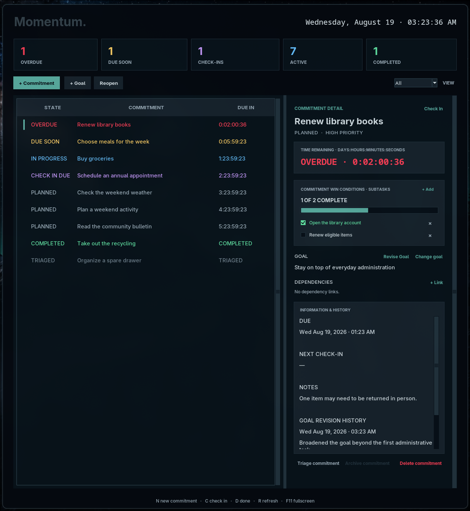

# Momentum Pact

> Make a pact; seize momentum.



Momentum Pact is a local-first accountability and executive-functioning
scaffold. It turns commitments into observable completion criteria,
dependencies, scheduled check-ins, and reviewable history without punitive
gamification or productivity theatre.

The design goal is **serene obligation**: responsibility should remain visible
and actionable without making pressure the mechanism of execution.

## Current capabilities

- Goals with deliberate, recorded revisions
- Commitments with due times and observable completion criteria
- Advisory required and helpful dependency links
- Scheduled check-ins with on-track, at-risk, blocked, and done outcomes
- Completion, conscious triage, archival, restoration, and deletion workflows
- Review-ready Markdown summaries and a scriptable JSON-backed CLI
- A neutral disposable demo covering every major state
- An optional, independently documented Waybar integration

Momentum Pact stores data locally and uses only the Python standard library at
runtime.

## Run the dashboard

Momentum Pact requires Python 3.11 or newer with Tk/Tcl support.
It is currently tested on Linux; Windows and macOS support has not yet been
verified.

```sh
python3 -m momentum_pact.app
```

Installed copies use the operating system's standard per-user application-data
directory by default. Set an exact path with either `--data` or
`MOMENTUM_PACT_DATA`:

```sh
python3 -m momentum_pact.app --data /path/to/accountability.json
```

The repository launch scripts explicitly retain the checkout-local
`momentum_pact/data/accountability.json` path for existing development data.

To launch a disposable product tour containing only fictional general-purpose
tasks:

```sh
./scripts/open-momentum-pact-demo
```

Demo data lives in a temporary directory and is discarded when the window
closes.

## Use the CLI

The CLI reads and writes the same data as the dashboard:

```sh
python3 -m momentum_pact.cli validate
python3 -m momentum_pact.cli list
python3 -m momentum_pact.cli review
python3 -m momentum_pact.cli add "Choose three projects" \
  --due "2026-09-01 17:00" \
  --win-condition "List candidate projects" \
  --win-condition "Select the final three"
python3 -m momentum_pact.cli check-in commitment_abc123 \
  --state at_risk \
  --note "Research took longer" \
  --next-action "Find the last source"
```

Run `python3 -m momentum_pact.cli --help` for the complete command surface.

## Keyboard shortcuts

- `N`: create a commitment
- `C`: check in on the selected commitment
- `D`: mark the selected commitment done
- `R`: reload the data file
- `F11`: toggle fullscreen
- `Esc`: leave fullscreen
- `Ctrl+Q`: quit

## Optional integrations

Waybar support is intentionally isolated from the core workflow. See
[docs/waybar.md](docs/waybar.md) if it is relevant to your Linux desktop.

## Verify

```sh
python3 -m compileall -q momentum_pact
python3 -m unittest discover -s tests -v
```

## Contributing

By intentionally submitting a contribution for inclusion in Momentum Pact, you
license that contribution under the Apache License 2.0 unless you clearly state
otherwise. Please identify any third-party material and its license, and only
submit work you have the authority to contribute.

## License

Momentum Pact is licensed under the [Apache License 2.0](LICENSE).

Thanks for taking a peek. I hope you find it as useful as I do.

More to come.
